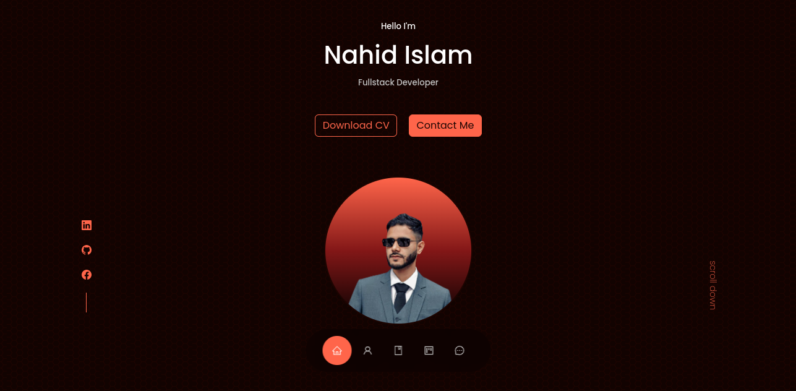

# React Portfolio Website 

<a style="border:1px solid salmon;padding:2px 6px;color:salmon;border-radius:0.4rem; text-decoration:none;" href="https://nahidislam.net">Live Site</a>

### Paltform and Tools

- React
- React Icons
- React Hooks
- React Resposive Modal
- Html React Parser
- Firebase Firestore (Database)
- EmailJs